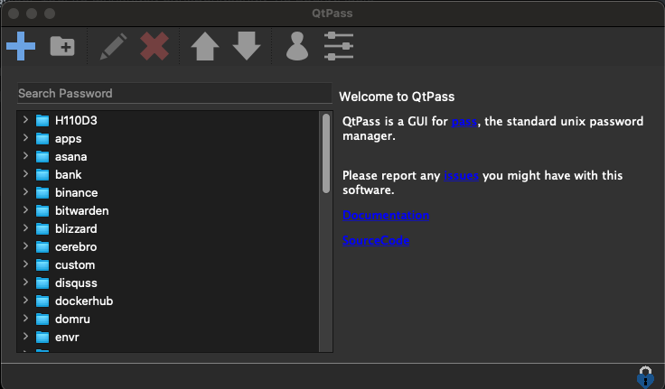
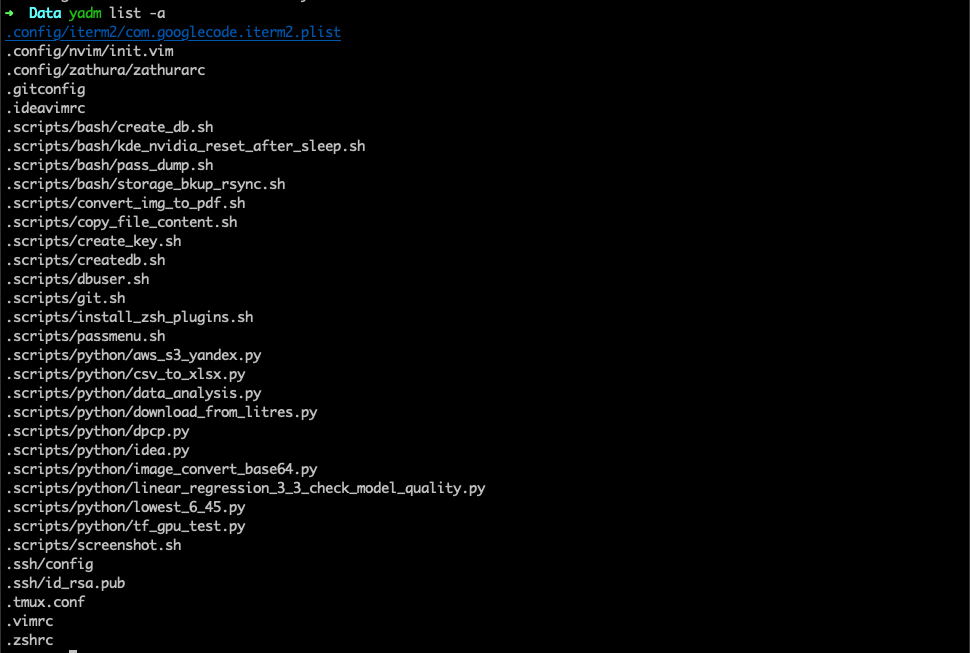
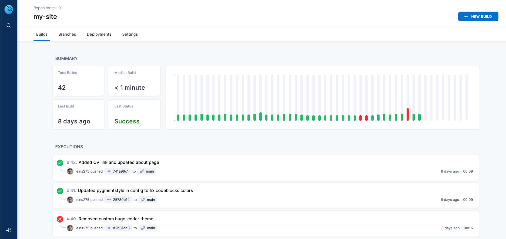

В современном мире, в очень насыщенной информационной среде компьютеры, смартфоны и другие гаджеты и электронные устройства играют очень важную роль. У каждого, и у меня в том числе, за долгие годы взаимодействия с компьютером накопилось много разной информации. И не всегда понятно, как это все богатство хранить, чтобы и найти было просто, и доступ был с любого нужного устройства, и чтобы самые важные данные как-то безопасно шифровались для пущей безопасности. Для этого нужна целая экосистема, и сейчас что-то похожее на готовую и целостную экосистему может предложить только apple. Но вообще говоря, если вам не получается ваш мир замкнуть только на устройствах кампании apple, по разным причинам, то нужно какое-то другое решение. Желательно кроссплатформенное, и чтобы еще можно было все данные хранить на своем сервере.

В рамках данной статьи я постараюсь изложить свои мысли по поводу всего этого. Выделю, на какие части я делю имеющуюся информацию, как ее организую, какими инструментами и сервисами пользуюсь сам и какие достойны рассмотрения. Также рассмотрим несколько кейсов, касающихся работе с девайсами и смене девайсов. Одна из целей создания подобной инфраструктуры - сделать замену одного устройства на другое максимально безболезненным.

# Какая бывает информация и как ее хранить

## Файлы

Более менее важные файлы тоже хочется синхронизировать между устройствами. Для этого лучше всего подходят облака. Можно пользоваться популярными облачными провайдерами, такими как гугл, яндекс и другие. Если же вы беспокоитесь о надежности своих данных, то имеет смысл рассмотреть решения, которые позволяют разворачивать облако на своем сервере. Я пользуюсь [nextcloud](https://nextcloud.com/athome/).

Nextcloud дает много преимуществ, таких как:

- Безопасность данных. Вы храните ваши данные на своем личном сервере, и меньше шансов что кто-то получит к ним доступ.
- На своем сервере вы можете получить больше места за меньшие деньги. У меня это raid1 на 1 терабайт.
- Расширения. Некстклауд имеет ряд очень полезных расширений, которыми вы можете покрыть практически все свои потребности, далее я постараюсь рассказать о самых интересных.

Как и многое из того, о чем вы прочтете далее, я подсмотрел у автора [этого блога](https://devpew.com/). Вы можете посмотреть его [видео о nextcloud](https://youtu.be/9bs-Q9cfayE), там он рассказывает много интересного. 

## Пароли

Пароли. Никаких "Один пароль для всего", "пароли в блокнотике", "Переставлю циферки в дне рождения бабушки". Сейчас у каждого минимум несколько десятков паролей от различных сервисов, все должны быть длинными, случайными и уникальными. Поэтому обходиться без менеджера паролей очень больно. Менеджер паролей должен позволять автоматически генерировать пароли (а также вводить вручную), синхронизировать их между всеми устройствами, а также обеспечивать их безопасность за счет шифрования.

Я расскажу про 3 хороших решения, хотя их конечно же гораздо больше. 

### Bitwarden

Очень хороший вариант - [Bitwarden](https://bitwarden.com/). Это классное решение с открытым исходным кодом, и его довольно легко настроить. Также есть возможность развернуть сервер битвардена на своем сервере, для повышения безопасности. Если вы вдохновились этим постом и хотите с нуля начать пользоваться менеджером паролей, и если вы не какой-нибудь продвинутый линуксоид, я вам настоятельно рекоммендую использовать имеено данный вариант, как самый простой и удобный, и при этом с открытым исходным кодом, что для менеджера паролей обязательно.

### Pass

Лично я пользуюсь [pass](https://www.passwordstore.org/). Это стандартный менеджер паролей для unix систем. Он использует gpg для шифрования, pwgen для генерации паролей, а также git для синхронизации. Я использую его уже больше года, полет нормальный. Не готов утверждать, что этот вариант более безопасный или удобный, просто я к нему привык и меня все устраивает. В целом с pass тоже довольно просто разобраться, но нужно будет больше времени потратить на то чтобы вникнуть в детали и разобраться с gpg ключами.

Вообще pass - консольное приложение, но на практике удобней использовать его вместе с каким-то gui фронтоном. Я пользуюсь qtpass, и забиндил его на определенный хоткей. У него есть удобный поиск и все что мне нужно.



Видео про pass: [1](https://youtu.be/niQ41gr1QsQ), [2](https://youtu.be/I2mwqC6HGGE)

### Nextcloud

У некстклауда есть расширение, которое позволяет вам хранить пароли. Это в целом тоже довольно удобный вариант, если вы развернули некстклауд - можете просто пользоваться расширением. Оно поддерживает шифрование паролей и также имеет мобильную версию.

## Конфиги

Очень больно бывает, когда потратил много времени на настройку рабочего окружения, а потом сменил компьютер. Хочется нажать кнопочку, и чтобы все настройки переехали на новое устройство. Поэтому лично я ужасно не люблю программы, которые нельзя настроить текстовым конфигурационным файлом. К сожалению, без подобных программ не обойтись, но возможность синхронизировать конфигурацию хотя бы части приложений - это уже большое дело.

И, как ни странно, для такого существуют специальные менеджеры конфигов! Расскажу только про тот, которым пользуюсь сам. 

Мне нравится [yadm](https://yadm.io/) - простой и удобный менеджер конфигов, который позволяет немного упростить синхронизацию через гит, а также добавляет некоторые полезные функции. Например, вы можете хранить разные версии конфигов для разных операционных систем, шифровать файлы и даже немного автоматизировать процесс настройки вашего окружения с нуля. Я пока что пользуюсь только функцией синхронизации, но подумываю написать скрипт автоматизации для переноса всех моих данных.

Тут наверное нужно сказать, что вы конечно можете синхронизировать конфиги и без всяких менеджеров, просто скопировав их в то же облако. Просто специальный менеджер позволяет вывести удобство работы с конфигами на совершенно новый уровень.

Вот так выглядит набор файлов, которые я синхронизирую через yadm:



## Заметки

Вопрос о хранении заметок содержит в себе широкое поле для обсуждений. Я не буду вдаваться в подробности различных методологий ведения заметок, просто расскажу о приложениях которыми пользуюсь я. 

Я делю заметки на 2 типа: 

- Заметки, содержащие полезные идеи или другую информацию, которую хочется сохранить, запомнить, и периодически к ней обращаться.
- Бытовые и временные заметки - "записал и не забыл". У меня это чаще всего это списки покупок в магазин. + Иногда такие заметки хочется пошарить.

Во-первых, приложения, хранящие заметки на своем сервере в проприетарном формате - это не круто. Я не люблю когда меня как-то привязывают к определенному инструменту, причем по совершенно пустяковой причине.

### Simplenote

[simplenote](https://simplenote.com/) - очень крутое приложение для заметок. Поддерживает маркдаун, кроссплатформенное, а также позволяет поделиться заметками с другими пользователями. 

### Obsidian

Очень мощное приложение, вдохновленное методологией ведения заметок [zettelcasten](https://habr.com/ru/post/508672/). Это приложение также базируется на markdown разметке, но в отличие от simplenote позволяет хранить заметки как простые текстовые файлы в своей локальной файловой системе. Также у него есть много классных фич, к примеру можно посмотреть граф своей базы заметок, выглядит очень футуристично. Вот для примера граф моей базы заметок на данный момент, пока что он не очень большой и целиком помещается на скриншоте.


Если вы заинтересовались темой, вот еще пара видео: [1](https://youtu.be/PiS3pRRj994) и [2](https://youtu.be/272ktGBBg8c)

### Nextcloud

И тут снова он. Также есть специальное расширение для заметок. Поддерживает маркдаун.

## База знаний

Очень кратко: база знаний - набор заметок и каких-то рецептов, которые позволяют вам не тратить время на то, чтобы 100 раз гуглить решения одних и тех же проблем. Думаю что для личного использования оптимально подойдет Obsidian, но для нескольких пользователей лучше использовать, например, wikijs.

## Задачи

Очень важно, если слово "продуктивность" для вас не пустой звук, использовать отдельное место для записи дел, которые вы хотите сделать. В целом вы можете записывать свои дела и на бумаге, но сейчас гораздо удобнее и проще это делать в электронном формате. Я пользуюсь [Todoist](https://todoist.com/ru), его бесплатная версия позволяет синхронизировать задачи между устройствами и делать все базовые вещи.

## Мероприятия

Также отдельно стоит выделять из списка дел мероприятия. Это дела, которые имеют смысл в определенный день, в определенное время и в определенном месте. Это может быть визит к врачу, ежедневная пробежка или новогодний корпоратив. По сути - задача, которой вы указываете дату и время и которая имеет к ним жесткую привязку может считаться мероприятием. 

Мероприятия, в отличие от обычных задач, удобно отмечать отдельно в календаре. Есть много разных календарей, google, outlook, да тот же Nextcloud. Думаю что большого смысла их подробно рассматривать нет. 

## Проекты

Все проекты, которые я делаю, сохраняются в систему контроля версий git. Не представляю, как кто-то может работать без гита. 

### Github

Самый известный и популярный гит сервер. Если вы делаете приличный опенсорз - он должен быть тут.

### Gitea

Это снова для тех, кому интересен вопрос своей собственной доморощенной инфраструктуры. Gitea - классный гит сервер, написанный на языке программирования go, который потребляет мало ресурсов и при этом приятно выглядит и поддерживает весь необходимый функционал.

### Drone CI

Эта штука еще больше "не для всех". Но если вы программируете, и хотите чтобы некоторые ваши пет-проекты увидели свет, то очень удобно настроить себе небольшой CI/CD сервис. 

drone позволяет вам подключиться к гит серверу и выполнять пайплайны в зависимости от каких-то действий с репозиторием. Например, я закоммитил новую статью в репозиторий с сайтом, который вы сейчас читаете, и drone автоматически собрал новую версию сайта.



# И как это все помогает в работе?

Итак, давайте рассмотрим ситуацию: вам выдали на работе новый компьютер, и вы хотите начать на нем работать.

1. Первым делом - нужно перекинуть приватные ssh и gpg ключи. Для повышения безопасности их хранения я их копирую просто механически. Для ssh ключей может потребоваться настройка прав доступа, gpg ключи же требуется импортировать. Либо в gnupg. Чтобы на маке у меня работал qtpass я также дополнительно ставлю [gpg suite](https://gpgtools.org/). После импорта дампы ключей нужно удалить.

2. После этого нужно склонировать репозитории с паролями и конфигами. Тут есть некоторая особенность. У меня эти репозитории хранятся на личном гит сервере, и чтобы клонировать с него по ssh нужно использовать нестандартный порт. Для этого нужно указывать ссылки на репозиторий в специальном формате:

   ```bash
   # cloning passwords
   git clone ssh://git@mydomain.com:[port]/owner/pass_repo_name ~/.password-store
   
   # cloning configs
   yadm clone ssh://git@mydomain.com:[port]/owner/dotfiles_repo 
   ```

3. Все, после этого большая часть важных конфигов у вас есть, а также доступ ко всем паролям. С ними можно уже легко авторизоваться во всех онлайн аккаунтах, какие нужны.

4. Установка программ. Можно сделать скрипт в котором ставить все нужные программы, но я делаю это ручками всегда, это не такая проблема.

5. Проекты переносить вообще не особо нужно. Если вы хотите продолжить работу с каким-то из проектов, просто снова склонируйте его с гита в папочку `Projects` и готово. 

6. С остальным просто. Подключить календарь, синхронизировать свои задачи и настроить клиент для облака совсем не трудно, когда восстановлен доступ к паролям.

После этих действий вам останется только доставить некоторые программы в процессе работы или войти в некоторые онлайн аккаунты. Это вообще не проблема.

Отдельно стоит сказать про настройку графического окружения. На windows как я понимаю ничего автоматизировать вообще нельзя. На macos скорее всего тоже, но я недостаточно изучил данный вопрос. На linux же ситуация несколько лучше. Например, в графическом окружении gnome 3 вы можете сдампить большую часть ваших настроек в файл, и затем импортировать их в новой системе. Еще круче - оконные менеджеры вроде i3wm. Их вы можете сконфигурировать отдельным текстовым конфигом, и тогда настройка системы с нуля будет завершена после переноса конфигов. 

Надеюсь, эта статья была чем-то для вас полезна. Я постараюсь подробнее раскрыть некоторые темы, затронутые выше, в следующих своих статьях.
