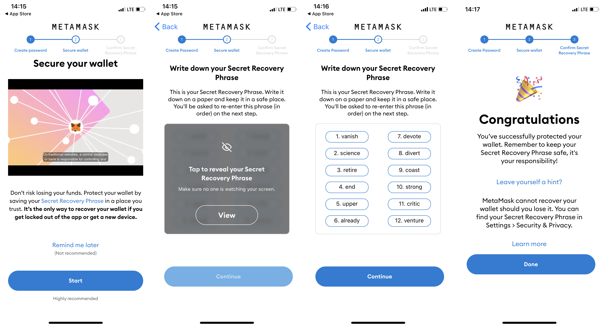

+++ 
draft = false
date = 2022-03-20T13:28:52+03:00
title = "Как майнить эфир"
categories = ["article"]
description = "Начинаем майнить эфир с нуля"
slug = "mining"
authors = ["leins275"]
tags = ["digital"]
+++
# Как начать майнить?

Это статья для тех, кто еще не успел разобраться с тем, как все устроено в мире криптовалют, но имеет компьютер с видеокартой и 
хотел бы начать майнить. Лично мне было тяжело найти какую-то простую и понятную инструкцию про то, как можно начать майнить, поэтому
купив новую видеокарту 3 года назад, я нашел время для того чтобы начать майнить только сейчас. В этой статье хочется кратко рассказать,
что конкретно вам нужно сделать чтобы начать майнить.

# Пара слов о майнинге в целом

В рамках данной статьи не хочется подробно разбирать, какие алгоритмы стоят за процессом майнинга. Для нас с вами важно то, что при
помощи майнинга вы можете заставить зарабатывать вашу видеокарту.

Если вы хотите подробней разобраться в майнинге, я рекоммендую прочитать для начала пару статей из блога [*Johenews*](https://www.youtube.com/channel/UCL4BwOrBEKggPyqsdVpraFg)
1. [Про криптовалюты и блокчейн простым языком](https://devpew.com/blog/cryptourrencies/)
2. [Алгоритм PoW. Что такое Proof-of-Work. Зачем нужны майнеры?](https://devpew.com/blog/pow/)

# На чем вообще можно майнить?

Вы можете майнить на процессоре, но это будет не особо продуктивно. Для майнинга лучше всего подходят именно видеокарты, так как
они имеют подходящую для этого архитектуру. И в целом, вам подойдет любая видеокарта, у которой размер видеопамяти позволяет вместить
dag файл. Я бы рекоммендовал рассматривать видеокарты с объемом видеопамяти не менее 6 гигабайт.

# Кошелек

## Что вообще представляет из себя кошелек для крипты?

Прежде всего, чтобы начать майнить, вам нужно создать собственный криптокошелек. По сути, это некоторое аппаратное или программное 
решение, которое хранит ваши приватные ключи.
Криптокошельки бывают разные. Полезно понимать, что кошельки бывают двух основных типов - холодные и горячие.

Холодные кошельки - это аппаратные решения, которые хранят все ваши приватные ключи, и доступ к ним вы получаете только подключив 
их к своему компьютеру. Потеряли кошелек - остались без денег. Но при этом вы также являетесь единственным хранителем своих денег,
и никак удаленно их у вас забрать или заблокировать невозможно.

Горячие кошельки - кошельки, которые хранят ваши ключи где-то на сервере. Все кошельки криптобирж являются горячими.
Использовать такие кошельки значительно удобней, но менее безопасно.

## Создаем свой первый криптокошелек

Мне сейчас удобней всего использовать криптокошелек `metamask`. Метамаск хранит все данные на вашем устройстве. При этом он предоставляет 
определенную гибкость по сравнению с аппаратными ключами. Подробно рассмотрим создание этого кошелька.
1. Для начала вам нужно скачать приложение `Metamask` на ваш смартфон из App Store или Play Market.
2. Открываем приложение и создаем новый кошелек. Используйте сложный пароль для вашего кошелька.
3. Вам придложат обезопасить ваш аккаунт, записав фразу восстановления кошелька, обязательно сохраните ее в безопасном месте.




Ура! Теперь у вас есть доступ к вашему кошельку. Для того чтобы начать майнинг, вам потребуется только публичный адрес кошелька, 
скопируйте его.

# Начинаем майнить

## Операционная система для майнига

Если вы серьезно подошли к вопросу и у вас есть целая ферма и вы готовы выделить отдельный ПК или сервер для майнига и только, то вы
можете поставить [Hive OS](https://hiveon.com/os_ru/). Это специализированная операционная система для майнинга на основе ubuntu.

Но скорее всего у вас просто есть какая-то видеокарта и один рабочий компьютер. Тогда для майнинга вам будет достаточно скачать программу
майнер, в которой реализован алгоритм майнинга. Далее кратко обсудим выбор программы и рассмотрим одну подробно.

## Выбор программы для майнинга

Тут важно понимать, что программа для майнинга которую вы выбрали делает именно то, что вы от нее ждете. Мне кажется среди программ 
майнеров есть не совсем добросовестные, скажем так, решения, которые могут в теории или отправлять куда-то ваши данные, или использовать
ресурсы вашего пк в своих целях. Всвязи с этим я настоятельно рекоммендую выбирать для работы только решения с открытым исходным кодом.
Даже если вы сами не читали весь код программы майнера, то:
1. Вы всегда можете это сделать, если захотите убедиться в "добросовестности" программы.
2. Кроме вас тысячи пользователей также могут просмотреть исходный код программы, и если в ней заложено какое-то сомнительное поведение,
это обязательно рано или поздно будет замечено сообществом.

Думаю, что решений с открытым кодом довольно много. Я рекоммендую вам пользоваться [ethminer](https://github.com/ethereum-mining/ethminer).
Ее плюсы очевидны:
 - открытый код
 - почти шесть тысяч звезд у репозитория, что говорит о высокой оценке сообщества и популярности программы.
 - Возможность работы на разных операционных системах, можно майнить и на линуксе, и на винде.

Теперь коротко о настройке программы и запуске майнинга. 

## Настраиваем ethminer на linux

Все настраивается очень просто, следуем инструкциям из репозитория. Для начала нужно скачать 
[последний релиз](https://github.com/ethereum-mining/ethminer/releases) программы для вашей ос. 
Мы рассматриваем майнинг эфира на линуксе, поэтому скачиваем вот эту версию. На момент написания статьи последний релиз выглядит так.


Просто скачиваете архив, распаковываете, и добавляете путь к exe в path, если вы на винде, или также добавляете в path если вы на линуксе.
После этого программа доступна, можно начинать майнить.

## Запускаем майнинг на linux

Теперь еще немного поговорим о процессе майнинга. Вы можете майнить соло, силами исключительно своей карты. Но эффективней будет 
подключиться к пулу майнеров. Пул объединяет и координирует усилия разных майнеров, тем самым увеличивая эффективность майнинга. 
Конечно он также берет комиссию, но обычно выгодней заплатить пулу.

Для того, чтобы стартануть майнинг, нам нужно просто запустить команду `ethminer`, указав набор нужных нам флагов(их список проще
всего уточнить используя `ethminer --help`) и url для майнинга.
 
Я запускаю майнинг следующей командой:
```bash
ethminer -P stratum1+tcp://<wallet-pub-address>.<username>@<mining-pool>:<port>
```

Посмотрите как устроен url для майнинга, который надо передавать в команде [тут](https://github.com/ethereum-mining/ethminer/blob/master/docs/POOL_EXAMPLES_ETH.md). Вам нужен свой адрес кошелька, который вы можете посмотреть в метамаске, адрес пулла к которому коннектитесь, 
а также порт, и еще указать ваш юзернейм. 

И все, по сути вы запускаете майнинг одной командой, вот так вот просто. Вы также можете зайти в веб интерфейс пула и посмотреть свою
статистику по майнингу. Также у пуллов скорее всего есть телеграм бот, в котором можно посмотреть текущую статистику. 

Деньги можно выводить по достижении определенной суммы, они будут списываться на ваш кошелек автоматически.

# Выводы

Как вы видите, на самом деле чтобы начать майнить вам не нужны глубокие познания в майнинге, криптографии и блокчейне. Если у вас есть
видеокарта, обязательно включайтесь в майнинг, это позволит вам со временем окупить ее стоимость, что очень выгодно.


