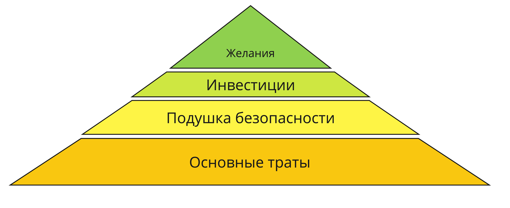

О том как (а главное - зачем) я веду учет личных финансов, и почему вы должны начать записывать свои расходы прямо сейчас

# Зачем вести финансы?

## Надежда на дядю и популярные заблуждения

Во времена СССР многие, если не все, жили от зарплаты до зарплаты. Зачем о чем-то беспокоиться? Обо всем уже подумала "партия", переживать не о чем. Государство копит за тебя деньги на твою пенсию, государство покрывает все твои экстренные нужды. Красота! Была бы, если бы это государство не рассыпалось в пыль вместе со всеми деньгами и надеждами на светлое будущее. 

Многие люди не любят заморачиваться. Кто-то считает, что если на жизнь и так хватает, то и зачем что-то считать? Или что нет смысла учитывать свои деньги, если тех денег то ни о чем? Как верно заметил [Johe News](https://youtu.be/TZn58EKqYFc) в своем видео, многие путают причину и следствие. Если у тебя денег нет - то скорее всего как раз потому, что ты их не считаешь.

Еще пример - сберкасса. Я деталей не помню, но у нас в семье бабушка копила в советские времена деньги для моей мамы в сберкассе. Накопила приличную сумму - что-то около 1000 рублей (Большие деньги). Однако в результате все это обесценилось, и в результате на все накопления был куплен мешок конфет, чтобы жить при торжестве коммунизма было не так горько. Чтобы совсем не быть голословным, думаю вся суть была в [этих процессах](https://ru.wikipedia.org/wiki/%D0%9E%D0%B1%D0%B5%D1%81%D1%86%D0%B5%D0%BD%D0%B5%D0%BD%D0%B8%D0%B5_%D0%BD%D0%B0%D0%BA%D0%BE%D0%BF%D0%BB%D0%B5%D0%BD%D0%B8%D0%B9_%D0%B3%D1%80%D0%B0%D0%B6%D0%B4%D0%B0%D0%BD_%D0%A1%D0%A1%D0%A1%D0%A0_(1990%E2%80%941992)).

Это я все к чему. В важных вопросах, а в частности вопросе финансов, можно рассчитывать только на себя! Никакие государства, никакие банки, даже лучшие и надежные, не могут считаться де-факто гарантом безопасности ваших средств. Всегда нужно диверсифицировать свои средства по совершенно различным активам, и делать это самостоятельно. Понятно, что серебрянной пули не бывает, но мне, если честно, на черный день сгодится и бронзовая.

## Нельзя контролировать то, что не можешь измерить

Итак, допустим мы осознали всю важность учета и контроля личных финансов. Но тогда мы можем столкнуться со следующей установкой:

> Я - человек спонтанный и творческий. И вы хотите, чтобы я себя ограничивал какими-то планами и схемами -  ну уж нет.

Тут я, как программист, могу привести интересную аналогию с языками программирования. Давным давно, когда деревья были большими, а компьютеры еще больше, люди вынуждены были управлять памятью в программах вручную. Это часто приводило к неприятным ошибкам, когда по невнимательности на первый взгляд рабочий код мог вызвать переполнение памяти и "все взрывалось к чертям собачьим". Поэтому в один момент была придумана концепция виртуальной машины, которая брала операции работы с памятью на себя. Сейчас этот подход использует подавляющее большинство языков программирования. Идея в том, чтобы не отвлекаться на технические детали, а заниматься непосредственно разработкой нужных алгоритмов.

Так вот, о чем это я все) Ваша система управления финансами - это как раз некое подобие виртуальной машины. Вся ваша спонтанность никуда не девается, просто вы держите ее под контролем. Чтобы что-нибудь не отлетело в глаз или в колено в неподходящий момент.

# Ставим цели для ведения финансов

Итак, после довольно многословного введения и попыток ответить на вопрос, а зачем вообще напрягаться и что-то там считать, начну делиться своим опытом)

Мне кажется важным, перед тем как начать что-либо делать, поставить перед собой правильную цель и затем планомерно к ней двигаться. 

## Безопасность

Хочется сформировать подушку безопасности, чтобы чувствовать себя уверенно в условиях турбулентности.

## Курица, которая несет золотые яйца

В книге Бодо Шефера "Пес по имени мани" главная героиня начинает откладывать часть заработанных денег "на курицу". По сути тут разговор о формировании капитала, который будет работать и в перспективе приностить неплохой пассивный доход. Мне кажется эта часть работы с деньгами очень важной, чтобы рано или позно сформировать капитал для пассивного дохода.

## Понимание своих целей и возможностей

Хотелось бы иметь возможность оценивать, что я могу себе позволить и когда. Насколько реальны цели, которые я перед собой ставлю, и сколько времени мне потребуется для их достижения.

## Комфорт и стабильность

Ну и хочется чувствовать некоторую уверенность в своих финансовых возможностях. Четкое понимание, что на любое стечение обстоятельств, благоприятное или неблагоприятное, у меня есть план А, а также B C и D.

# Общие подходы

## Что имеем на входе?

Думаю, у каждого есть ворох счетов. Набор каких-то источников доходов. Какие-то из них более постоянны, какие-то спонтанны. Наверное, еще стоит выделять такую вещь как активы, но в данной статье я их рассматривать не буду.
В этом разделе расскажу про свою структуру для организации счетов.

## Категоризация счетов

Начнем, пожалуй, с категорий счетов. Лично я все свои счета делю на 4 большие категории. Тут можно провести аналогию с пирамидой маслоу. Я для себя расставляю их в таком порядке, хотя может возникнуть желание, простите за коламбур, поместить свои желания ниже)

## Основные траты

Счета, с которых я трачу деньги. 

На этих счетах лучше всего не хранить денег больше, чем нужно на месяц в среднем. Если планируется какая-то большая трата, то средства просто в нужный момент переводятся с накопительного счета на счет трат.

## Подушка безопасности

Счета этой категории нужны, чтобы хранить на них средства, необходимые на случай возникновения каких-то экстренных ситуаций. 
Мне кажется такие счета должны обладать высокой ликвидностью, чтобы с них можно было максимально быстро в любой момент получить деньги. То есть не вклады с ограничением на снятие, не брокерские счета, а максимум какие-нибудь сберегательные счета.

Про то, сколько денег должно быть в подушке безопасности, есть множество разных рекоммендаций. Я для себя считаю, что было бы неплохо достичь суммы, которая в 6 раз превышает сумму моих среднемесячных расходов. 

## Накопительные счета

Это счета, как понятно из названия, являются основными для накоплений. Под накоплением я понимаю или простое хранение средств, или откладываение на какие-то цели или крупные покупки.

Я использую для этого также накопительные счета, но тут все на так категорично. Если вы четко сформировали для себя горизонт, на котором будете откладывать средства для ваших целей, вы можете использовать и более интересные в плане доходности виды счетов.

Это такая, категория по умолчанию. Все входящие средства можно сваливать в эту категорию, и уже потом думать, что с ними дальше делать.

## Инвестиции

И, наконец, инвестиции. Для себя выработал подход, что наиболее оптимально будет определить для себя некий процент от среднего ежемесячного дохода, который буду регулярно переводить на инвестиционный счет. 

С инвестициями важно быть аккуратным, не вклвадывать то, что жалко потерять. Также важно помнить, что это самый неликвидный вид активов. Чтобы инвестировать "с чувством, с толком, с расстановкой", деньги лучше вкладывать на довольно длительный срок, без учета возможности их снятия для каких-то форс-мажоров. Для них у нас есть подушка безопасности.

Также из своей практики я заметил, что если вдруг произошла растрата подушки безопасности - лучше потратить какое-то время на ее восстановление. Иначе ее роль на себя начнут перетягивать ваши инвестиционные активы, а этого нам бы не хотелось.

# Планирование бюджета

## Категории расходов

При учете расходов важно правильно распределять их между категориями. Основное - категорий должно быть немного, и они должны представлять интерес для трекинга лично для вас. 

Я пользуюсь приложением Zenmoney. Оно позволяет задать иерархию категорий с одним уровнем вложенности, что довольно удобно. Можно использовать небольшое число категорий первого уровня, а затем при желании детализировать внутри категорий по более мелким категориям.

В целом, можно представить мое распределение по категориям в виде следующей схемы

Изначально у меня есть девять базовых категорий. Шесть из них относятся к регулярным расходам, остальные три я характеризую как планы. Не всегда конечно траты по ним получаются запланированными, но это дело десятое) 

## Магическая категория - "прочее"

Если вы пробовали вести учет расходов, то наверняка замечали, что постоянно на какую-то мелочь тратится больше, чем вы там себе напланировали, и это факт как бы ставит под сомнение всю идею что-то там такое планировать или предсказывать. В попытке побороться с этим досадным моментом, я использую сборную категорию "прочее". Не все траты в ней разделяются на подкатегории, что-то так и остается в родительской категории. Идея в том, чтобы на основании ваших регулярных трат накопить даннные, достаточные для построения средней оценки. Всю мелочевку конечно не учтешь, но если ее таким нехитрым образом обобщить, то уже можно что-то прикидывать с приемлемой точностью.

При этом конечно все что касается категорий и подкатегорий у каждого будет индивидуально. Например, я покупаю одежду часто тогда, когда уже ну вот никак без этого не обойтись, откладываю до последнего. Если вы любите устроить себе шопинг для удовольствия, то у вас конечно эта категория должна учитываться как-то иначе. 

И еще момент. Часто любят делить траты на обязательные и необязательные. Якобы от необязательных вы можете отказаться. Так вот, категория прочее относится именно к обязательным тратам. Плавающим, но не тем, от которых можно отказаться. Все, что реально необязательное или связано с желаниями, я выношу в зеленые категории.

## Планирование бюджета

Теперь немного про то, как я планирую движение денег. Есть бюджет, и планы. В бюджете я оцениваю, сколько на основании текущей ситуации и статистики за прошлые месяцы я потрачу в каждой из обязательных категорий(темно-желтые с прошлого скрина + прочее). Также отдельно я оцениваю планы. Чаще всего они распределяются в зеленые категории, но не всегда и не обязательно. Вот такая примерная схемка.

В Zenmoney есть функциональность как бюджета, так и планов, но в последнее время мне как-то удобней все делать в экселе. Сейчас я большее внимание уделяю именно планам, сколько я могу позволить себе потратить в грядущем месяце, обязательные расходы уже довольно хорошо аппроксимируются статистикой. Я веду учет расходов уже года 4, однако сейчас у меня набор данных на которые я ориентируюсь начинается с сентября 2022 года. Чем больше у вас данных, тем точнее оценки, поэтому чем раньше вы начнете накапливать их, тем лучше. Даже если какое-то время вы никак не будете анализировать то что записываете, когда вы созреете, у вас уже будет материал под руками. Ваш, личный, не чей нибудь. 

## Денежный поток

Ну и также полезно расписать, как у вас будет организован денежный поток. Сколько на какой счет денег приходит, как вы их потом распределяете по счетам и в какой пропорции. Вот основные принципы: 
1. Выделяйте сразу необходимую сумму на месяц. Лучше чуть чуть ее занизить, но не сильно. Это позволит вам держать руку на пульсе и не перерасходовать лишнего
2. Не забывайте об инвестициях. Можно определить небольшой процент от дохода и регулярно его переводить на инвестиционный счет. Ориентируйтесь по объему сами, как вам комфортно.
3. Формируйте подушку безопасности. Я пришел к выводу, что оптимально классифицировать операции пополнения подушки лучше всего как планы. Тоесть в списке ваших планов заранее запланируйте пополнение, чтобы оно вписывалось в другие ваши планы.
4. Все, что пришло бонусом и незапланировано - переводите на накопительные счета. 

# Идеи для развития

## Учет активов

Было бы круто как-то учитывать свои крупные активы, автомобили, недвижимость, все такое. У меня пока не то чтобы много активов в личном владении, но на будущее это было бы интересно продумать и вписать в общую схему учета

## Разработка своего приложения для учета

Как только я притру свою систему максимально под себя, и будет ресурс на реализацию, я бы создал какую то свою программу для учета финансов. Но пока что вполне справляюсь готовыми инструментами, думаю что они вполне покрывают 99.9% всех юзкейсов.

## Рекоммендательная система для инвестиций

Было бы круто иметь какую-то свою систему, которая могла бы подсказывать мне, как лучше в данный момент распределять свои средства по активам.

