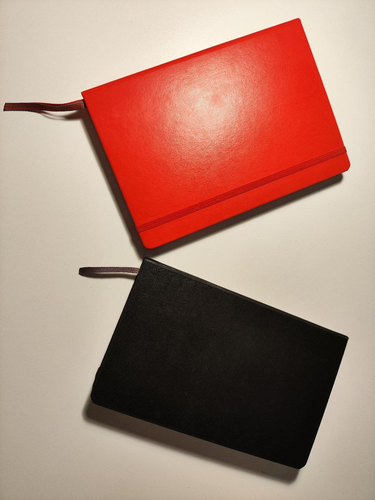

В последнее время довольно активно пользуюсь разными аналоговыми блокнотами. Когда целый день работаешь за компьютером, хочется смены формата работы. В этом мне помогают блокноты. Письмо от руки в целом довольно приятное и умиротворяющее занятие. Однако хотелось бы сделать этот процесс не только приятным, но и полезным. Как я пользуюсь блокнотами для этой цели - далее в статье.
# Популярные методологии
Мой подход по сути представляет собой некоторую компиляцию и адаптацию того, что уже есть. Существует много разных хорошо описанных методов ведения блокнотов. Я их рассматриваю как некоторые модельные приемы и техники, из которых можно собрать систему, максимально подходящую конкретно для меня.

Главным образом конечно на меня повлиял Bullet Journal. Из него я взял многие вещи, считаю эту методику очень дельной. Однако также существуют другие разные техники, например commonplace book, Scanner dairy, Classic dairy, Morning pages и так далее. Про каждый подробно писать не буду, если интересно - можете почитать про них подробнее
# О расщеплении блокнотов
Передо мной постоянно встает вопрос - один блокнот для всего или несколько блокнотов по темам? Вопрос этот не тривиальный, и однозначного ответа конечно нет. 

| Плюсы расщепления                                                  | Недостатки расщепления                 |
| ------------------------------------------------------------------ | -------------------------------------- |
| Отделение чувствительной информации (Такой как дневниковые записи) | Не всегда ясно, куда лучше записать    |
| Разная разлиновка                                                  | Поддержа нескольких блокнотов - сложно |
| Срок службы увеличивается                                          | Усложняется поиск                      |

Для себя я пришел к тому, что разделяю все записи на два блокнота, по цели использования. Один используется для самонаблюдения: дневниковые записи, планы на месяц и год, трекер привычек - все там. А второй - для записи идей (в широком понимании). 

Таким образом я:
- Отделяю персональную информацию в отдельный блокнот. Могу спокойно брать с собой везде блокнот для идей и не волноваться, что кто-то где-то прочтет мои дневники.
- Упрощаю поиск. Обычно я что-то ищу именно в идеях, и круто когда дневниковые записи не путаются под ногами.
- Продлевая срок службы каждого из блокнотов. 

Несмотря на то, что блокнота у меня 2, основные принципы для них универсальны. Дальше расскажу про них, в основном конечно апеллируя к блокноту для записи идей.
# Метаинформация в блокнотах
Чтобы процесс фиксации идей был максимально осмысленным, важно иметь понятную структуру и возможность поиска. Для этого обычно используют разную метаинформацию.

Каждый блокнот я подписываю определенным образом. Самое важное - это индексация. Каждый блокнот у меня имеет свой порядковый номер, таким образом я могу при необходимости ссылаться на записи из предыдущих блокнотов.

Также метаинформация присутствует на каждой странице. Во первых, страницы в обязательном порядке нумеруются, это важно для ссылок и построения индекса. Также на каждой странице я ставлю дату, заголовок, и при необходимости ссылки на связанные записи. Я использую два типа ссылок. Если заметка является продолжением какой-то идеи, я могу указать предыдущую или следующую за ней страницу. Если я просто хочу отметить связь с другой заметкой, я ставлю отдельно номер связанной страницы.

# Базовые принципы
Фиксация принципов - базовый подход для повышения личной эффективности. Хорошие принципы позволяют не думать лишний раз в типовых ситуациях, и сфокусировать свое внимание на важном. Ниже - ключевые принципы, которыми я пользуюсь при работе с блокнотами.
## Страница - как минимальная логическая единица
В своих записях я рассматриваю страницу как наименьшую логическую единицу. Я не нумерую отдельные записи, не выделяю их как-то специально. Вся работа со ссылками и индексом ведется только в контексте страниц. 

Это же касается длинных заметок. Если мысль не помещается на одной странице, я не "просто пишу дальше на следующей", а оформляю отдельную страницу как продолжение, ссылаясь при этом на предыдущую страницу. В частности, такой подход решает проблему продолжения идеи на странице в случае, когда следующие страницы уже содержат новые идеи.

По сути, страницы представляют собой либо конкретные идеи, либо какиe-то коллекции в терминах Bullet Journal.
## Индекс
Все страницы должны быть отмечены в индексе. Это значительно упрощает поиск по блокноту. Обычно я формирую индекс в начале блокнота, рассчитав чтобы было место для всех страниц. Страницы индекса не озаглавливаются и не нумеруются - таким образом я максимизирую место под ссылки. 

Элемент индекса - ссылка на страницу. Обычно это номер страницы или страниц, и заголовок страницы. Иногда я добавляю специальные символы для важных страниц, чтобы находить из максимально быстро.

Хоть индекс является базой для структуры, кроме него можно добавлять и другие структурные коллекции. Например, я сейчас экспериментирую с предметным указателем. Его главное отличие от индекса в том, что элементом предметного указателя является не страница, а тема. И для каждой темы приводятся ссылки на все страницы, которые к этой теме относятся.

## Все идеи фиксируются
Важно фиксировать все идеи. Я постоянно о чем-то думаю, и только начав фиксировать свои мысли начал замечать, что при кажущемся изобилии разных идей, на самом деле процесс мышления часто вращаeтся вокруг одних и тех же базовых тем. И только фиксатция и структуризация идей позволяет протолкнуть мыслительный процесс в развитии. 

Не все мысли или идеи которые приходят в голову тянут на отдельную страницу по объему. Если я понимаю, что фиксирую какой-то короткий фрагмент, то я записываю его в специальную коллекцию - Jots. Для этого использую формат rapid logging из Bullet Journal. Единственное - в коллекции Jots только идеи, нет ни задач ни событий, как в классическом Bullet Journal. Задачи я веду отдельно в Todoist, А события фиксирую в другом блокноте, который для самонаблюдения.

# Резюме
Рад был поделиться своим подходом к ведению блокнотов. Надеюсь, вы нашли что-то полезное для себя из моей статьи. 