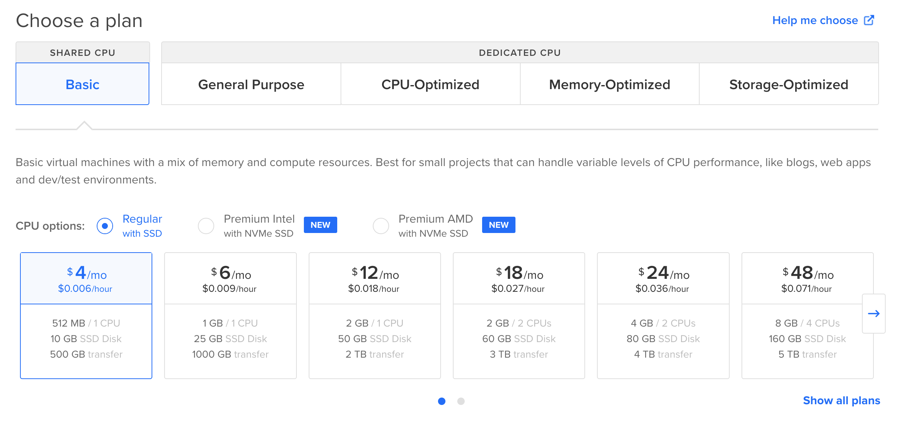

Обычно СУБД в продакшене это довольно сложная штука. Нужно правильно настроить кластер, позаботиться о его безопасности, эффективной работе и все в таком духе. В этой статье я расскажу, как развернуть СУБД postgresql на выделенном сервере. Я периодически делаю разные небольшие пет-проекты, и в них обычно используется база данных. При этом и объемы данных, и нагрузка на сервер минимальная. Так что в рамках этой статьи мы сфокусируемся на том, как сделать себе надежную СУБД для маленьких проектов с удобным доступом и за небольшие деньги. Ну и немного поговорим о конфигах, дампах и клиентах.

# Выбираем хостинг и создаем сервер
Я буду использовать в качестве хостинга [DigitalOcean](https://www.digitalocean.com/), вы также можете использовать любой другой хостинг. Также рекоммендую свою [рефералку](/about/) для регистрации.

## Почему не database as a service?
DigitalOcean предоставляет возможность использовать базу данных как сервис. Это значит, что все управление и конфигурация базы будет лежать на DigitalOcean, а вы просто будете пользоваться этой СУБД. Я не использую данную опцию просто потому, что она в несколько раз дороже выделенного сервера. При этом если у вас ожидаются более менее серьезные нагрузки на базу, а вы не готовы заниматься ее конфигурацией самостоятельно, думаю эту опцию вполне можно рассмотреть.

# Создаем дроплет 
На диджитал оушене виртуальный сервер называется дроплетом. Я выбираю самый дешевый сервер, на данный момент такой стоит 4 доллара.



Остальные настройки выбирайте сами, главное не забудьте добавить свой ssh ключ для подключения к серверу. Я рассчитываю на очень скромные нагрузки в первое время, поэтому создаю сервер с минимальными ресурсами. В последствии их можно будет расширить. 

# Ставим нужные пакеты
В качестве операционки я выбрал Ubuntu 22.04, так как она "просто работает". Сначала обновим систему и затем поставим сервер постгреса и нгинкс следующими командами.

```bash
sudo apt update -y && sudo apt upgrade -y
sudo apt install -y postgresql postgresql-contrib nginx
```

Ну и не забудьте включить все это дело:

```bash
sudo systemctl enable --now postgresql
sudo systemctl enable --now nginx
```

# Настраиваем нгинкс 

Чтобы нгинкс мог проксировать коннекшн к базе, нужно добавить новый stream block в `nginx.conf` .  

Изменения в nginx.conf:

```nginx
...
# end of nginx.conf file
stream {
	inclue /etc/nginx/sites-enabled/db;
}
```

При этом мы также создаем файл `/etc/nginx/sites-enabled/db` с описанием прокси к базе:

```nginx
server {
	listen 1234 so_keepalive=on;

	allow 123.123.123.123;
	# ...
	deny all;

	proxy_connect_timeout 60s;
	proxy_socket_keepalive on;
	proxy_pass localhost:5432;
}
```

Тут нужно указать:
 - порт, по которому будете подключаться к субд, в примере выше это `1234`
 - список айпи адресов, с которых разрешен доступ в базу, можно указать несколько айпишников в несколько строк, до deny all;

> Чтобы узнать ip адрес своего компьютера, можно воспользоваться сайтом https://ifconfig.me/.

После изменений в конфигах перезапустите нгинкс, и ваша база данных будет готова обрабатывать соединения.

[исходная статья](https://wasi0013.com/2021/11/15/setup-nginx-reverse-proxy-to-access-postgresql-database-remotely/)

# Настройка доступов 

Перед тем как тестировать, что соединение с базой работает, создадим тестовую базу и роль для подключения. Для этого перейдем в psql и выполним следующие команды:

```bash
sudo -u postgres psql
create database test123;
create user test123 with password '123';
grant all privileges on database test123 to test123;
\q
```

Все, теперь мы можем подключиться к серверу базы как пользователь test123 и паролем `123` и базой test123.

# Пару слов о клиентах

Чтобы протестировать подключение к базе, проще всего воспользоваться каким-то клиентом. Можно воспользоваться одним из [графических клиентов](https://proglib.io/p/8-luchshih-gui-klientov-postgresql-v-2021-godu-2021-09-20). Также рекоммендую консольный клиент pgcli. Он позволяет подключиться к удаленной базе и может примерно то же самое что и psql, только с более интересной подсветкой и автодополнением.

# Дополнительные настройки 

Конфигурационный файл находиться по следующему адресу: `/etc/postgresql/<version>/main/postgresql.conf`. Я считаю, что в нашем случае можно все настройки оставлять по дефолту, но вы можете при необходимости подкрутить параметры базы в этом файле.

# Перенос данных базы в другую директорию
Если вы настраивали базу так же, как в примере, то все данные у вас будут сохраняться в дефолтной директории в разделе /var. В случае, если база будет разрастаться в объеме, может возникнуть необходимость добавить места под данные. Чтобы не расширять конфигурацию сервера, мне кажется удобней будет подключить отдельный диск и перенести данные на него. О том, как перенастроить постгрес на работу с другой директорией с данными, рекоммендую изучить в [этой статье](https://fitodic.github.io/how-to-change-postgresql-data-directory-on-linux).

# Бэкапы
Ну и немного про сохранность данных. В нашем простом случае имеем:
 - данных немного (<< 10Gb). 
 - Ресурсы на поднятие аналогичного окружения минимальны

Так что вместо того чтобы долго и упорно конфижить постгрес для оптимальной безотказности и производительности, проще всего настроить бэкапы и если что восстанавливаться из них, при необходимости даже на абсолютно новом окружении.

В нашем случае достаточно будет утилиты pg_dumpall, вот команда для того чтобы сделать полный дамп всего содержимого нашей СУБД

```bash
pg_dumpall -c -U postgres > dump_`date +%d-%m-%Y"_"%H_%M_%S`.sql
```

Все. После исполнения этой команды имеем один файл со всеми нашими данными.

Рекоммендую через [крон](https://timeweb.com/ru/community/articles/chto-takoe-cron) настроить сразу периодическое создание дампов и сохранять их там где вам удобно. При использовании каких-то публичных облаков лучше дамп шифровать. Для шифрования рекоммендую gpg, про него можно почитать, например, [тут](https://devpew.com/blog/gpg/).

Для того, чтобы данные из дампа загрузить в свежесозданный инстанс постгреса:
```bash
cat yourdump.sql | sudo -u postgres psql
```

- [[content/posts/pet-projects/index|Pet projects]]