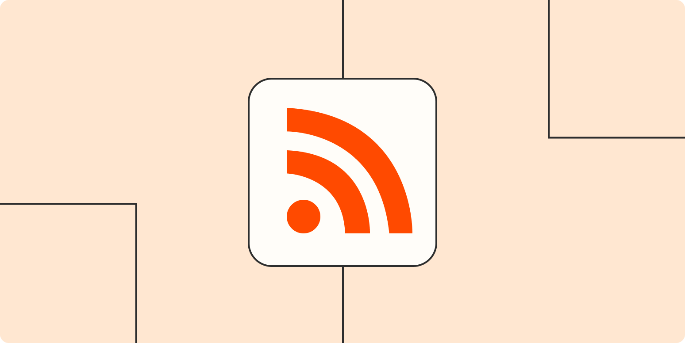

+++ 
draft = false
date = 2022-07-31T19:50:54+03:00
categories = ["article"]
title = "Все о RSS"
description = "Что такое rss и как этим пользоваться"
slug = "rss"
authors = ["leins275"]
tags = ["digital", "productivity"]
images = ["posts/rss/img/preview.png"]
+++

Сегодня я бы хотел рассказать о такой штуке, как RSS. Самые продвинутые пользователи интернета конечно про нее знают, формат существует с 90х годов прошлого века. Но я узнал про RSS на прошлой неделе, и так мне эта штука понравилась, что я решил поделиться со всеми. Вдруг вы тоже не слышали про такое, но на самом деле давно искали.

# Что такое RSS

RSS – Это спецификация для описания новостных лент в формате xml. При помощи такого описания можно подписаться на обновления из любого источника, и собрать весь контент в одном месте.

# Программы для чтения RSS

Есть много разных удобных читалок. Я попробовал несколько самых популярных программ, но в итоге остановился
на [Feedly](https://feedly.com). [Inoreader](https://www.inoreader.com) тоже неплох, в целом программы очень похожи 
по функционалу, я выбирал скорее исходя их визуальных предпочтений.

Также для iPad есть классная программа [Unread](https://www.goldenhillsoftware.com/unread/), о которой я узнал из [этого
видео](https://youtu.be/PK9zshkvvD8). Если Feedly позволяет мне формировать список подписок и распределять их по категориям, 
то в Unread очень удобно именно читать новости, у программы очень классный и удобный интерфейс.

# На что можно подписаться?

По сути это не принципиально. В RSS могут быть описаны любые новостные ленты, как на сайте, так и например в социальных 
сетях. Таким образом, при помощи этой замечательной технологии можно читать все последние новости и посты в одной ленте.

Для того чтобы подписаться на какой-то блог, вам нужно знать rss адрес. Обычно в качестве адреса достаточно указать адрес
сайта. Например, данный пост опубликован на странице https://leins275.xyz. Чтобы подписаться на обновления моего сайта, 
вы просто указываете в качестве rss адреса https://leins275.xyz. Мне кажется в большинстве блогов и новостных сайтов это 
устроено именно так.

Также можно подписаться на новости их какой-нибудь социальной сети. В feedly есть возможность подписаться на обновления
из reddit и twitter из коробки. Например в vk можно также подписаться по rss на обновления канала, если автор этого 
канала предоставляет разметку своих постов в rss формате. Если интересно, вот классная 
[статья](https://habr.com/ru/post/458182/) про чтение обновлений из vk по rss.

# Для авторов контента

Также RSS может экономить время вам как автору. Например, есть у меня сайт, на котором я иногда публикую разные статьи. И мне бы хотелось, чтобы мои статьи также автоматически публиковались в социальных сетях. При помощи rss я могу подписаться на обновления своего сайта в большинстве социальных сетей и публиковать там новые статьи с сайта автоматически.

# Выводы

RSS - супер формат, который позволяет как читать контент из разных источников в одном месте, так еще и создавать контент
для разных платформ единожды. На мой взгляд это черезвычайно удобно. Если вдруг вы не знали про такой способ подписки, 
надеюсь теперь ваша жизнь в соцсетях станет чуть более организованной и удобной. А если вдруг вы знаете другие интересные
способы применения RSS - обязательно поделитесь в комментариях.

