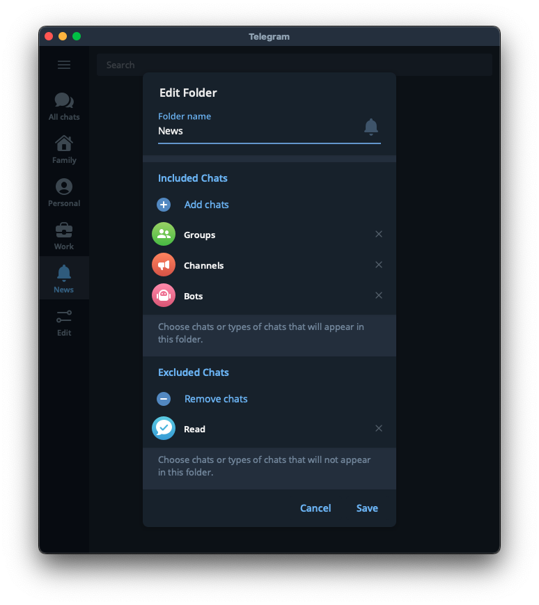

+++ 
draft = false
katex = false
authors = ["leins275"]
date = 2023-03-27T21:59:28+03:00
title = "Джедайский телеграм"
description = "Постигаем дзен в омуте чатов"
categories = ["article"]
slug = "telegram"
tags = ["productivity"]
series = ["по теме: Джедайские техники"]
images = ["https://leins275.xyz/posts/telegram/img/1.png"]
+++

Телеграм - основной мессенджер и источник входящих у многих современных людей. Хотелось бы поделиться парой трюков, как снизить залипабельность телеграма, и грамотоно использовать инбокс.

Идея этого материала у меня появилась после просмотра этого [видео](https://youtu.be/ZP_0AYCunwM) на канале Максима Дорофеева, тут я просто пересказал основные мысли своими словами и в своем контексте.

# Покоряем уведомления
Первым делом - отключаем все уведомления. Отключить все и потом включить нужное - гораздо проще, чем пытаться отключить все лишнее. Также телеграм позволяет отключать уведомления у всех новых чатов.

У меня включены уведомления только для нескольких личных переписок, сообщения в которых мне важно обработать как можно быстрее.

# Очищаем инбокс
Под инбоксом мы обычно имеем ввиду папку входящих в электоронной почте, где одним списком представлены все новые сообщения. В телеграме все немного не так, обычно там каша из личных и рабочих чатов, в которые постоянно прилетает что-то новое.

Чтобы получить некое подобие нормального инбокса, можно поступить следующим образом:
- Закрепить папку избранное, пересылать в нее все сообщения, которые нужно будет позже дополнительно обработать. Это будет наш инбокс.
- Все чаты - в архив. Чтобы на основной странице телеграма были только закрепленные избранные сообщения.

# Создаем структуру
Все чаты в архиве - это конечно здорово, ничего не отвлекает, зато теперь ничего не найти. Кончено, у телеграма довольно удобный поиск, но хочется помимо него иметь под рукой важные чаты, и желательно в какой-то удобной структуре. Для этого телеграм позволяет создавать папки, и довольно гибко настраивать их поведение. 

## Моя структура папок
В кратце - мой телеграм сейчас содержит 4 папки. 

## Семья
Тут собраны все переписки с семьей. Их я обрабатываю в приоритетном порядке, к тому же тут их проще найти.

## Личные чаты
Этот чат удобно создать из шаблонов телеги. Вот скрин с настройками. В этом чате появляются только личные сообщения, которые мне приходят. Как только я их прочитаю - они пропадают. Если при чтении я вижу что-то, что важно будет обработать позднее - пересылаю сообщение в избранное.

Раньше у меня была отдельная папка "Друзья", в которой я собирал личные переписки, но структура как на скрине ниже кажется мне более универсальной.

## Рабочие чаты
Как можно было бы догадаться, тут собраны рабочие чаты. Что важно - только актуальные и только важные рабочие чаты. Если, допустим, какой-то проект завершился или встал на паузу, то чаты этого проекта перестают быть актуальными, и их можно удалить из рабочей папки. Очень помогает держать в фокусе только важное.

## Новости
Это, на мой взгяд, самая интересная директория. Работает как новостной агрегатор. Сюда попадают все группы, новостные каналы, более не актуальные рабочие чаты, все в таком духе. Ее содержимое не обязательно к просмотру "вот прямо сейчас", так что выделение такой папки позволяет меньше отвлекаться на все залипабельное, что прилетает в телеге.

Если вы особо подвержены залипанию и хотите с этим побороться - можно вообще не иметь такой папки, и только иногда ее временно создавать в удобный момент. Благо телеграм позволяет создать ее быстро из шаблона. Я же предпочитаю не удалять, так как добавляю в исключения папки некоторые чаты, от которых жалко отписываться пока, но на которые не хочется тратить свое внимание.

# Заключение
Буду рад, если вы узнали что-то новое для себя о возможностях телеграма, и это окажется полезным.

