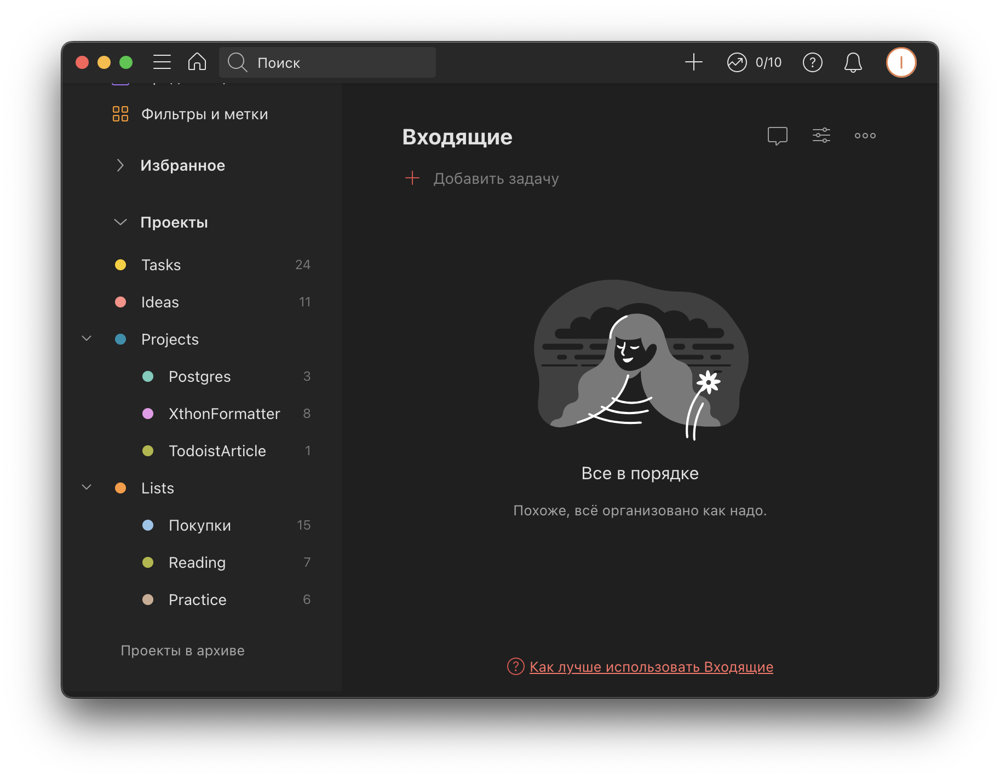

+++ 
draft = false
date = 2022-07-07T01:18:01+03:00
categories = ["article"]
title = "Джедайский todoist"
description = "Настройка todoist в стиле джедайских техник"
slug = "todoist"
authors = ["leins275"]
images = ["posts/todoist/img/preview.jpg"]
series = ["по теме: Джедайские техники"]
tags = ["productivity"]
+++

Однажды, бродя по ютубу в поисках откровений о продуктивности, я наткнулся на [выступление Максима Дорофеева](https://www.youtube.com/watch?v=fWR5SFhBUWc&t=14s). Оно меня восхитило, потому что он говорил очень просто, живо, чередуя емкие факты, красивые примеры и интерактивные задачки. Они здорово иллюстрировали особенности нашего мышления, о которых шел разговор, и делали все выступление ярче и необычней. Наверное поэтому этот человек мне запомнился.

В дальнейшем я стал заглядывать на [ютуб канал Максима](https://www.youtube.com/c/MaximDorofeev), на котором он делился 
своими мыслями о продуктивности в виде коротких разговорных видео. Многие его идеи были мне очень близки, и я видел
в них большой потенциал для себя. В какой-то момент я понял, что по сути эти видео являются небольшими отрывками
идей из книги Максима, "Джедайские техники". И я решил наконец познакомиться с первоисточником этого классного знания, что в 
конечном итоге полностью перевернуло мое мировоззрение и, как я узнал из книги, повысило уровень джедайской зрелости.

# Пробы пера

С выбором основного инструмента ведения задач все было довольно просто. Максим сразу предупредил, что,
цитата: "Нету идеальных инструментов, придется смириться". Сейчас доступно много хороших todo приложений, но каждое в
чем то окажется неудобным и придется изобретать обходные пути.

Я не долго думая решил выбрать тудуист, так как был знаком с ним по выпуску [айти бороды](https://youtu.be/VFBXx7O9BxU). Интерфейс мне понравился и я начал пользоваться. Позднее я как-то уже прикипел к интерфейсу, и теперь уже не готов с ним расстаться. 

Пару лет я экспериментировал, пробовал разные подходы к ведению задач, но всегда чего-то мне не хватало. Путь к оптимальной 
для себя методике продуктивности труден и тернист, быстро найти его не получается. Какой-то прогресс это мне дало, но обычно
максимальный эффект повышения продуктивности сохранялся недолго. А в какой-то момент я настолько раскис что в момент кризиса
не смог справиться с управлением собой и своими задачами.

# Кризис

Точкой кипения для меня стал момент, когда на меня с трех сторон навалились две работы и магистрский диплом. 
Я стал все хуже обрабатывать входящие задачи, допускал много ошибок, делал задачи не из списка и в итоге получил негативный фидбек от заказчика,
который пришлось потом активно исправлять усердной работой. Ситуация довольно быстро разрешилась, но оставила мне на память неприятный осадок.

Это дало мне некий волшебный пинок, и я решил полностью переосмыслить свою практику джедайских техник. Знать о такой замечательной системе личной продуктивности
и неправильно ей пользоваться кажется мне весьма обидным обстоятельством.

# С чистого листа

Последний кризис на работе ясно дал мне понять. Я уже два года пытаюсь пользоваться джедайскими техниками, но так и не уловил суть, раз со мной случаются такие 
неприятные казусы. Как только у меня выдалась свободная минутка, я решил пересмотреть некоторые видео Максима и провести работу над ошибками.
Вот основные моменты, на которые я обратил свое внимание при переработке своего подхода.

## Задачи, проекты и идеи

> Один из основопологающих аспектов джедайских техник - разделять, задачи, проекты и идеи.

Да, мысль простая, довольно понятная, но действительно внедрить ее было тяжело. Я решил потратить столько мыслетоплива, сколько потребуется, но разделить их, 
собрав при этом в одну удобную и красивую систему.

Думаю тут важно сделать небольшую вставку для тех, кто совсем не понимает о чем речь. 

 - **Задачи**

 	Это то, что надо делать, и понятно, как делать. Уже обуманные и хорошо сформулированные конкретные действия для нашего
	низкоосознанного состояния.

 - **Проекты**

 	Это то, что тоже надо делать, но перед этим нужно думать, как именно это делать. Перед тем как приступить к конкретным
	действиям по проекту, нам нужно выделить некоторые первые шаги в виде конкретных и понятных задач. Потом следующие
	шаги, и так до тех пор, пока мы не сможем считать проект завершенным.

 - **Идеи**

 	Идея - это такая сущность, про которую изначально непонятно, а нужно ли ее вообще делать. Идеи периодически приходят 
	к нам в голову в контексте определенного эмоционального настроения. При детальном рассмотрении, изначально казавшаяся
	гениальной идея может быть совершенно неинтересной для реализации. Нужно всегда записывать идеи в список, чтобы они 
	не мешались в голове, и не стестняться выкидывать неактуальные идеи, это экономит кучу времени и сил.

Также даю [ссылку на видео](https://youtu.be/1Zr_ydPsmas) Максима о задачах, проектах и идеях.

## Ежедневный и еженедельный обзоры задач

> В привычку должны войти практики ежедневного и еженедельного обзора задач.

Это тоже базовая практика из джедайских техник. Я использовал ее и раньше, но недостаточно скрупулезно.
И в своей новой системе я полностью пересмотрел свой подход к этим обзорам.

Если кратко изложить суть обзоров, то получится следующий алгоритм работы с задачами.

1. Все задачи записываются в список входящих.

2. В рамках еженедельного обзора мы переносим в наш тудуист задачи из других источников, в моем случае это
рабочие списки задач. А также просматриваем все задачи и проекты одним списком и выбираем себе задачи на следующую неделю.

3. В рамках ежедневного обзора мы разбираем свой инбокс с пришедшими за день задачами, и выбираем задачи на завтра из списка,
составленного при еженедельном обзоре.

Такой подход стандартизует процесс работы с задачами, позволяет периодически просматривать весь список задач, чтобы не 
потерять ничего важного, а также чувствовать себя спокойней и уверенней.

Теперь давайте посмотрим, как эти две практики я использую в своих джедайских техниках.
Но сначала немного о том, почему я использую именно todoist.

# Почему именно _todoist_?

1. Он простой. Очень. В нем нет практически ничего лишнего, только нужные для записи задач инструменты.

2. Интерфейс. Он выделяется среди других тудушников, которые как будто друг у друга срисовывали элементы интерфейса.
Всегда приятно пользоваться тем, что выглядит красиво, работает гладко и сделано с душой. 

3. За простотой скрывается мощь и гибкость. Возможность создавать свои интеллектуальные фильтры при помощи 
текстовых запросов является ключевой фичей для интеграции джедайских техник. 

# Мой путь джедая

В этой статье я не буду подробно останавливаться на том, что из себя представляют джедайские техники, а настоятельно рекоммендую почитать книги
или посмотреть видео на канале Максима Дорофеева. Он расскажет все гораздо лучше меня. Мне же интересно поделиться своим подходом, тем как 
я веду свои задачи и проекты.

У меня далеко не сразу получилось найти оптимальный для себя подход к ведению задач. Первые два года были чередой
проб и ошибок, да и до сих пор я не до конца уверен что достиг полного просветления. 

Ключевой момент для меня был - осознать, как правильно работать с задачами, проектами и идеями. Но начнем не с этого.
Начнем с того, что как мы помним, оптимальных инструментов нет. И приходится подстраивать возможности конкретного 
инструмента под свою конкретную практику продуктивности. Для меня очень важны задачи и возможность быстро и удобно их создавать и группировать в проекты.
Но также для меня огромную роль играют фильтры и метки, при помощи них я выстроил 
некоторый подход, который при своей простоте позволяет практиковать ежедневные и еженедельные обзоры красиво. 
Давайте по порядку.

## Проекты

Самым сложным для меня было убедить самого себя, что сущность проекта
в тудуисте по смыслу отличается от сущности проекта в джедайских техниках. Теперь я использую проекты тудуиста исключительно 
как контейнеры для задач или списков. Далее буду называть проекты тудуиста контейнерами, а под проектом иметь ввиду сущность проекта из джедайских
техник.

Сейчас мой раздел проектов в тудуисте выглядит так:

Как видите, я использую иерархию контейнеров. На первом уровне иерархии у меня располагаются Список задач, проектов, идей, а 
также "список списков". Рассмотрим каждый отдельно.

1. **Tasks** _(Список задач)_

    Cтандартный контейнер для всех задач. Все входящие задачи в последствии перерабатываются,
    снабжаются всеми необходимыми деталями и переносятся в контейнер _Tasks_

2. **Ideas** _(Список идей)_

	Все идеи я обязательно определяю в этот контейнер. К нему в комплекте идет периодическая задача, для просмотра
    списка идей. Если я завершаю часть активных текущих проектов, то могу при просмотре списка идей взять какую-то идею 
    в работу и создать из нее проект. В таком случае идея отмечается сделанной и я приступаю уже к работе над проектом.

	Ну и также бывает,
    что часть идей со временем кажутся не такими интересными и привлекательными как при создании, тогда я их 
    удаляю. Мне кажется, понимание того, что не все идеи настолько хороши чтобы их делать черезвычайно полезно)

3. **Projects** _(Список проектов)_

	С проектами все несколько сложнее. Поскольку сущность проекта в джедайских техниках сама по себе является довольно
	сложной и включает в себя список задач проекта, то элементами моего списка проектов в тудуисте являются не задачи, как 
	например в случае с задачами и идеями, а тоже проекты. Тудуист позволяет такое делать благодаря наличию иерархии контейнеров.

	Все новые проекты, которые создаются из идей, попадают в мой список проектов. Также в тудуисте есть возможность использовать
	такую иерархию для настройки отображения задач из всех проектов, но об этом позже. 

	Кроме того, такой подход к проектам позволяет контролировать объем задач. Я например стараюсь не держать активными более 3х проектов
	одновременно, чтобы не перегрузить себя.

4. **Lists** _(Список списков)_

	Этот контейнер подобен списку проектов тем, что на втором уровне вложенности хранит список контейнеров. Контейнеры в этом списке 
	являются просто какими-то списками, которые я использую для удобства в своих бытовых вопросах. Сейчас у меня есть в этом 
	разделе список для чтения, куда я записываю книги, которые хотел бы когда-нибудь прочитать, спискок покупок и список практик.

	Самый часто используемый список в этом разделе - список покупок, к нему я обращаюсь чаще всего. Там у меня записано все,
	что я бы хотел или планирую купить. От продуктов до более глобальных вещей, таких как пылесос или новый монитор.

	Последний список выделяется от остальных. Там в виде задач, которые нельзя выполнить (фича тудуиста) у меня собраны разные
	полезные практики. Этот список я завел для того, чтобы в свободную минуту можно было к нему обратиться и выбрать какую-то
	полезную практику. Пока не очень распробовал этот прием, но мне кажется многим он также может быть полезен. Если мы снова
	возвращаемся к джедайским техникам, то это такой мой способ записать то, что можно было бы назвать образом жизни. Не могу 
	сказать что я нашел в этом способе какую-то вселенскую истину для себя, но пока что у меня сделано именно так.

Может показаться, что такая структура слишком сложна, и неудобно потом будет заходить в каждый проект и просматривать там задачи.
Полностью согласен, так оно и есть. И это было бы действительно неудобно в повседневном использовании, если бы не было фильтров
и меток. Они позволяют гибко настроить удобные отображения для всех задач, чтобы в одном месте можно было сразу посмотреть только то, что
нужно. О них я подробно расскажу в следующем разделе.

## Фильтры и метки

Метки позволяют удобно группировать задачи, не используя контейнеры. А фильтры поддерживают достаточно гибкий механизм запросов, который 
позволяет просмотреть одним списком все задачи, которые вас интересуют. Я использую только самый минимум фильтров и меток, который позволяет мне упростить 
практику ежедневных и еженедельных обзоров. 

Я считаю, что добавлять метки просто для красоты - пустая трата времени. Они должны помогать 
вам в вашем общении со своими задачами, иначе они просто бесполезны. Сейчас мои фильтры и метки устроены следующим образом:

Согласно GTD и джедайским техникам, все задачи сначала попадают в список входящих. Далее им присваевается время выполнения,
контейнер, а также другая метаинформация. Затем в рамках еженедельного обзора мы выбираем
себе задачи, которые хотим сделать на следующей неделе. Точнее не совсем так, в рамках еженедельного обзора мы
определяем, из каких задач мы будем на следующей неделе выбирать себе задачи на следующий день.

Если бы у нас не было списка проектов, то мы могли бы просто сделать контейнеры _позже_ и _неделя_. В моем случае мне удобно иметь отдельные контейнеры под каждый
проект, но при этом сохранить единый список для ежедневного обзора. 

Я делаю следующим образом. В рамках еженедельного обзора я просматриваю список, из всех задач из контейнера _Tasks_, а также из всех контейнеров с проектами.
Для этого у меня есть специальный фильтр _Review_.
Задачи, которые я бы хотел сделать на этой неделе, я помечаю меткой `@waiting`. И потом все задачи, которые отмечены этой меткой
показываются мне в другом фильтре, который используется при планировании следующего дня при ежедневном обзоре.

Также у меня есть возможность быстро добавить новые задачи из инбокса на неделе в список для ежедневного обзора, что тоже весьма удобно.Еще мой фильтр 
показывает задачи, отмеченные метками `@ITS` и `@EPAM`. Ими я помечаю задачи, которые я в рамках еженедельного обзора перетащил к себе в тудуист из своих рабочих
трекеров задач. Ну и как вишенка на торте - если я выбираю из этого списка себе задачу на завтра, тоесть назначаю ей конкретный срок выполнения, то она из списка 
пропадает. И наоборот, если я не успел сделать сегодня запланированную задачу и убрал у нее дату - она возвращается в этот список. Это супер удобно!

Еще я не рассказал про два вспомогательных фильтра, _week clean_ и _today clean_. Их я использую для того, чтобы посмотреть, сколько я себе реальных задач запланировал
в такой-то день. Они просто удаляют из отображения задачи, которые отмечены меткой `@RITUAL`. А этой меткой, как вы могли догадаться, я помечаю 
периодические задачи, которые у меня постоянно повторяются просто для того, чтобы я не забывал о каких то практиках и действиях.

Ну и для наглядности вот фильтрующие запросы, которые я использую в своих фильтрах, если хотите - можете скопировать их себе и попробовать:

## Избранное

Простой и понятный, но от этого не менее удобный раздел избранное. Сюда можно добавить любой проект, фильтр или даже метку, чтобы иметь быстрый доступ к ним для 
просмотра определенных задач. У меня в избранном добавлены все фильтры, а также мой список покупок, так как мне удобно иметь туда максимально быстрый доступ
в тот момент, когда я пытаюсь вспомнить в магазине, что мне нужно.

## Приоритеты задач

В рамках джедайских техник приоритеты скорее излишни. Тутуист предоставляет 4 уровня приоритетов для задач, я их изредка 
использую для того, чтобы удобней отсортировать свои задачи на сегодня в списке отображения, так как проставить приоритет 
бывает удобней чем перетащить задачу выше, и в отображении работает автоматическая сортировка по приоритету. 

Какое-то более
серьезное проставление приоритетов не кажется мне особо осмысленным, так как в джедайских техниках используются другие 
приемы для выделения задач. Например, если какая-то задача считается важной, то вместо проставления ей высокого приоритета
лучше переформулировать ее максимально просто и понятно, чтобы вам сразу захотелось ее сделать.

# Заключение

Как вы видите, моя система не самая простая, но при этом она не содержит ничего лишнего, а главное - удобна именно для меня. Я потратил много времени на ее создание и 
внедрение в повседневную жизнь, но результат меня радует. Призываю вас к тому же: пробуйте, ищите свою схему для управления
задачами, благо благодаря фильтрам, меткам и иерархии проектов тудуист позволяет настроить все очень гибко и удобно. Буду рад, если кому-то понравится мой 
подход и он найдет его также полезным и удобным для себя, значит я не зря писал эту статью. Спасибо за внимание, всем продуктивности!

