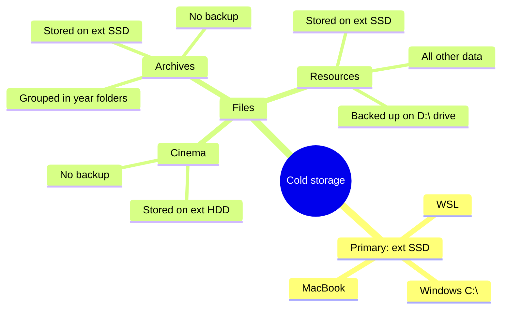

Корневая директория - домашняя папка пользователя. 
Далее выделяются следующие директории:
1. `Downloads` - Папка загрузки по умолчанию. Удобно использовать с группировкой по дате изменения
2. `Desktop` - Почти всегда пустой, иногда используется как временная рабочая папка
3. `Git` - Кастомная папка, в ней все гит репозитории
4. `GDrive` - Полностью синхронизированный гугл диск в формате PARA (100 Gb). Горячее хранилище с самым частоиспользуемым.
5. `Cold` - Файлы, которые хранятся только на локальном диске.

> [!info]
> Никакие другие директории на компьютере не используются!

В данный момент у меня основной компьютер на windows и MacBook как вспомогательный ноут для перемещений. Все используют данную струткуру каталогов.
# Cold storage

---
- [[Моя информационная инфраструктура]]